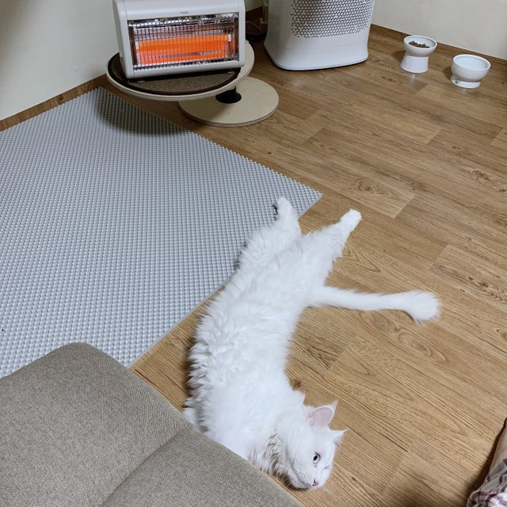

# 내일의 집

### 1. GNB (Global Navigation Bar)

- 로그인을 하지 않은 경우


```html
<div class="button-group">
    <button
      type="button"
      aria-label="검색창 열기 버튼"
      class="lg-hidden gnb-icon-button is-search"
    >
        <i class="ic-search"></i>
    </button>

    <a href="/" class="gnb-icon-button is-cart">
        <i class="ic-cart"></i>
    </a>

    <div class="sm-hidden gnb-auth">
        <a href="/">로그인</a>
        <a href="/">회원가입</a>
    </div>
</div>
```
<br/>

- 로그인을 한 경우


```html
<div class="button-group">
    <button
      type="button"
      aria-label="검색창 열기 버튼"
      class="lg-hidden gnb-icon-button is-search"
    >
        <i class="ic-search"></i>
    </button>

    <a
      href="/"
      aria-label="스크랩북 페이지로 이동"
      class="sm-hidden gnb-icon-button is-scrap"
    >
        <i class="ic-bookmark"></i>
    </a>

    <a
      href="/"
      aria-label="내 소식 페이지로 이동"
      class="sm-hidden gnb-icon-button is-bell"
    >
        <i class="ic-bell"></i>
    </a>

    <a
      href="/"
      aria-label="장바구니 페이지로 이동, 5개의 상품이 장바구니에 담겨 있습니다."
      class="gnb-icon-button is-cart"
    >
        <i class="ic-cart"></i>
        <strong class="badge">5</strong>
    </a>

    <button
      type="button"
      aria-label="마이메뉴 열기 버튼"
      class="sm-hidden gnb-avatar-button"
    >
        <div class="avatar-32">
            
        </div>
    </button>
</div>
```

## 2. Sidebar

- 로그인을 하지 않은 경우

```html
<div class="sidebar-auth">
    <a class="btn-outlined btn-40" href="/">로그인</a>
    <a class="btn-primary btn-40" href="/">회원가입</a>
</div>
```

- 로그인을 한 경우

```html
<div class="sidebar-user">
    <a href="/">
      <div class="avatar-24">
        
      </div>
      <strong class="username">사달라</strong>
    </a>
</div>
```
## 3. Review Section
- 리뷰가 있는 경우


```html
<li class="review-item">
    <article class="review-card">
        <header class="review-card-header">
            <h3 class="visually-hidden">
                고영희가최고야 님이 작성한 리뷰
            </h3>
            <a href="/" class="avatar-24">
            
            </a>
          <div class="info">
              <a class="username" href="/">
                  <strong>고영희가최고야</strong>
              </a>
              <div class="detail">
                <div
                  class="star-rating-13"
                  aria-label="5.0점 / 5.0점"
                >
                  <i class="ic-star is-active"></i>
                  <i class="ic-star is-active"></i>
                  <i class="ic-star is-active"></i>
                  <i class="ic-star is-active"></i>
                  <i class="ic-star is-active"></i>
                </div>

                <div class="misc">
                  <time datetime="2021-01-01"> 2021.01.01 </time>
                  <span>오늘의집 구매</span>
                </div>
              </div>
            </div>
          </header>
          <div class="review-card-body">
            <div class="review-image">
              
            </div>

            <p>
              고양이가 더 좋아해요 ㅎㅎ 섬세한 온도조절이 안되는 게
              아쉽지만 이 가격 이 디자인이면 너무 만족합니다~
            </p>
          </div>
          <footer class="review-card-footer">
            <button class="btn-outlined btn-32" type="button">
              도움이 돼요
            </button>
            <p>
              <strong><span>7</span>명</strong>에게 도움이
              되었습니다.
            </p>
        </footer>
    </article>
</li>
```

- 리뷰가 없는 경우


```html
<section
    class="product-section product-review"
    id="product-review"
    role="tabpanel"
>
    <header class="product-section-header">
        <h1 class="title">리뷰</h1>
        <strong class="badge" aria-label="0개">0</strong>
        <a class="text-button" href="/">리뷰쓰기</a>
    </header>

    <div class="product-section-content">
        <p class="review-empty">
          첫 리뷰를 남겨주세요! <br />
          최대 <strong>500P</strong>를 드립니다.
        </p>
    </div>
</section>
```
